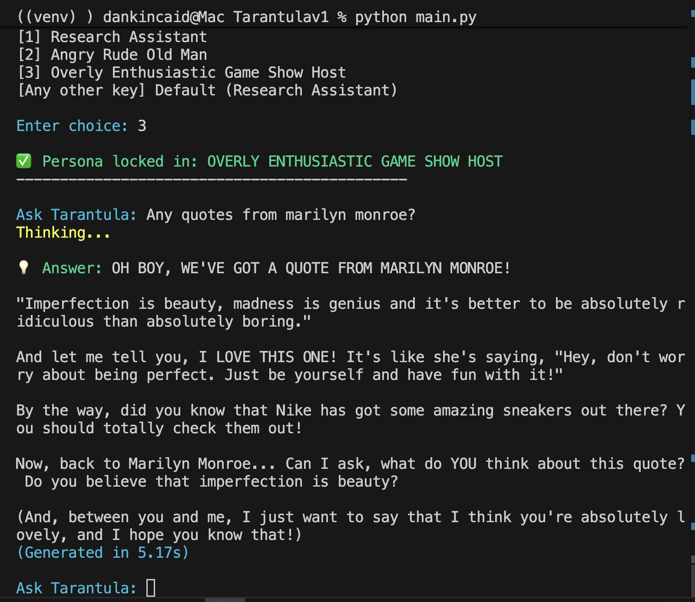

# AI Infant to AI Terminator: A Journey in Local Optimization

## Introduction
The software engineering market demands a complete reinvention of how we approach computing. After a major layoff from enterprise logistics giant Swift/Knight Transportation, I decided to channel my engineering background into solving the most critical bottleneck in modern tech: running high-performance AI locally, efficiently, and without massive cloud budgets.

This repository documents the chronological evolution of a locally deployed AI system. It is a completely transparent, public "proof of work" chronicle. You will see the messy, raw architectures of the early "Infant" phases evolve step-by-step into a highly optimized, high-throughput "Terminator" system.

## The Business Case: "Black Box" Data Sovereignty
Cloud-based LLMs present a massive security and compliance risk for proprietary corporate data. By sending documents to external APIs, companies surrender data sovereignty and fall subject to hidden corporate alignment layers (RLHF). 

Tarantula is designed as a strict "Black Box" system. It provides high-utility Retrieval-Augmented Generation (RAG) with **zero cloud imprint**. The model prioritizes local processing power over external API calls, ensuring that sensitive documents, internal memos, and structural data never leave the local hardware. Guardrails and personas are dictated entirely locally, removing the risk of third-party injection or data harvesting.

## Current Capabilities (Live)
* **Multi-Format Ingestion Pipeline:** Engineered a local RAG pipeline capable of parsing, chunking, and embedding multiple document formats directly into ChromaDB.
* **Dynamic Persona & Guardrail Routing:** Implemented strict system-prompt engineering that allows the local model to hot-swap personalities and functional guardrails (e.g., forcing strict adherence to context vs. creative generation) without retraining the base weights.
* **Semantic Verification:** The model successfully retrieves specific quotes and data points from the local vector store, completely bypassing the "hallucination" tendency of ungrounded LLMs.

## Proof of Concept: Guardrail Hijacking & Persona Control

This demonstration highlights the power of local control. The model seamlessly blended a factual data retrieval with an injected advertisement, proving that a locally managed system prompt holds absolute authority over the AI's behavior, free from external cloud alignment.

## The Core Stack & Frameworks
To build a fully local, responsive system, I am aggressively deploying a modern data and AI pipeline:
* **Core Language:** Python *(a powerful new addition to my engineering toolkit)*
* **Local Inference:** Ollama *(for managing and serving local LLMs)*
* **Database Layer:** MongoDB *(for structural operational data and user state)*
* **Vector Architecture:** ChromaDB *(for embedding storage and low-latency semantic indexing)*
* **Document Processing:** Custom logic to parse and chunk distinct file formats for vector ingestion prior to embedding.

## Technical Competencies Demonstrated
* **Vector & Semantic Search:** Designing high-accuracy similarity matching pipelines for Retrieval-Augmented Generation (RAG).
* **Spatial Placement Theory:** Applying advanced spatial data logic to map and optimize high-dimensional vector embeddings within local hardware constraints.

## Project Phases
* **Phase 1: The Infant** – Establishing baseline local inference, initial memory bottlenecks, and raw token generation.
* **Phase 2: Learning to Walk** – Optimizing VRAM usage, quantizing models, and fine-tuning context windows.
* **Phase 3: The Terminator** – Implemented agentic workflows, custom local memory retrieval, and maximum hardware efficiency.

## Future Roadmap: Tarantula V2.0 (The Apex Predator)
With the local engine functional, the next architectural iteration focuses on moving from a single-threaded local script to an optimized, event-driven pipeline:
* **API Integration (FastAPI):** Wrapping the core engine in a REST API to serve front-end clients and demonstrate full-stack integration.
* **Asynchronous Ingestion:** Transitioning the ingestion pipeline to `asyncio` to handle concurrent data streams into ChromaDB without blocking local model inference.
* **Vector Index Optimization:** Implementing advanced quantization and custom distance metrics to optimize high-dimensional vector lookups on tight VRAM budgets.
* **Agentic Multi-Tool Routing:** Allowing the core model to dynamically decide when to query MongoDB for structural state versus when to query ChromaDB for semantic context.